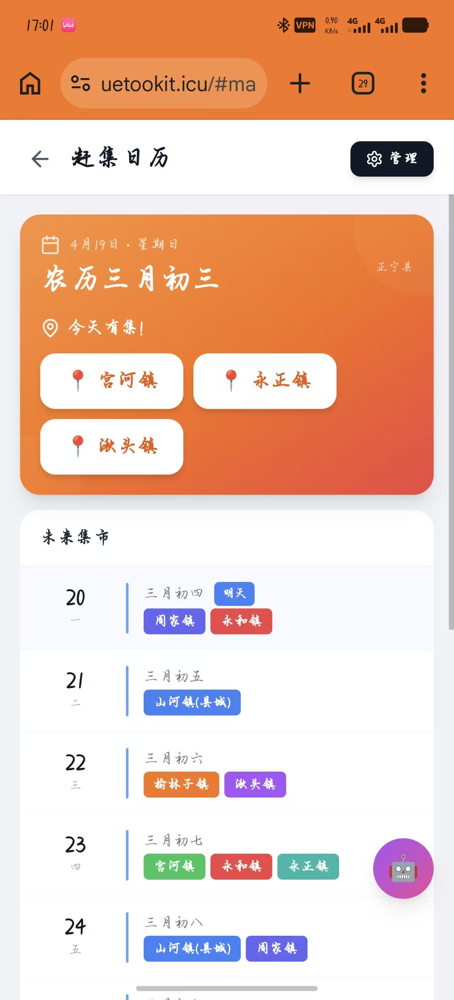
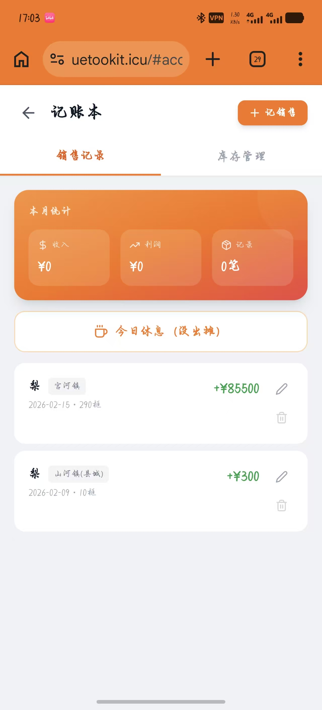
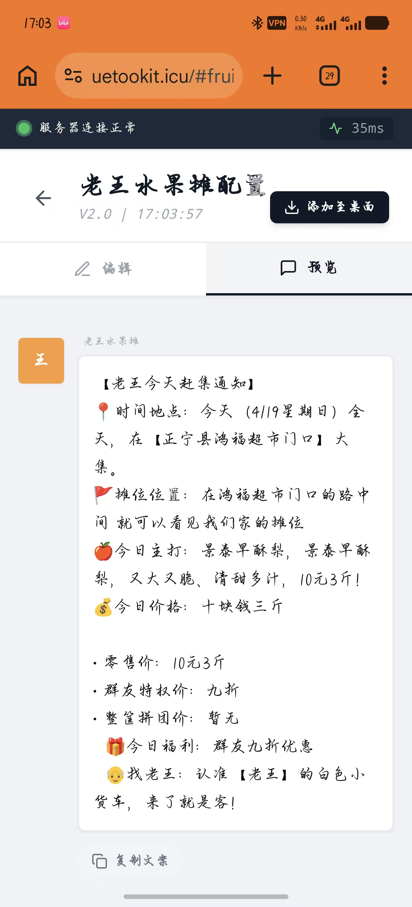

# 摆摊小助手


专为摆摊人打造的实用工具集 PWA 应用。

🌐 **在线访问**: [https://www.uetookit.icu](https://www.uetookit.icu)

## 功能

- 🗓️ 赶集日历 - 基于农历的赶集日提醒
- 📒 记账本 - 进货、销售、库存、利润管理
- 📝 促销文案 - 一键生成群发文案
- 🤖 AI 助手 - 智能问答

## 📱 功能展示

### 赶集日历



### 记账本



### 促销文案生成



### AI 助手


## 技术栈

React 18 + Vite + Tailwind CSS + PWA

## 开发

```bash
npm install
npm run dev       # 开发服务器
npm run build     # 构建
npm run release   # 发布新版本（交互式）
```

## 部署

推送到 main 分支后 Vercel 自动部署。

## 数据

所有数据保存在浏览器本地 localStorage，不上传服务器。
